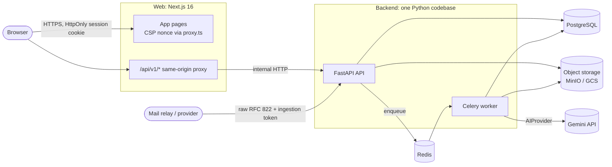
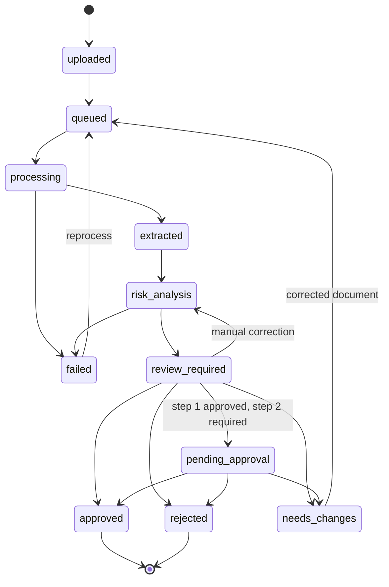

# Architecture

A **modular monolith with asynchronous workers** ([ADR 0001](adr/0001-modular-monolith-with-async-workers.md)):
one backend codebase that runs as two process types (API and worker), one PostgreSQL
database, Redis for queueing, and S3-compatible object storage. There are no
microservices, no Kafka and no Kubernetes.

## System diagram



## Processes and responsibilities

| Process | Responsibility |
| --- | --- |
| **web** (Next.js) | UI, session-cookie handling, CSP. The `/api/v1/[...path]` route forwards requests to the API with header allow-lists, so the browser only ever talks to one origin. |
| **api** (FastAPI) | Authentication, RBAC, tenant scoping, validation, CRUD, ingestion (upload, URL import, inbound email), review decisions, reads for the UI. It never runs slow work inline. |
| **worker** (Celery) | Invoice processing pipeline (extraction, vendor/PO matching, risk engine, AI explanation) and inbound-email processing. Retries only transient failures, with a bounded count. |
| **postgres** | System of record, including the append-only audit trail (enforced by a trigger). |
| **redis** | Celery broker and result backend, plus rate-limit counters. |
| **object storage** | Original documents and raw emails, under tenant-prefixed generated keys. |

## Backend modules (`apps/backend/app`)

```
core/        settings, JSON logging (Cloud Logging format), errors, middleware, security primitives
db/          SQLAlchemy base, sessions, column types
models/      ORM models (21 tables), all tenant-owned rows carry organization_id
finance/     Decimal money arithmetic, GSTIN validation, GST checks (pure functions)
ai/          AIProvider protocol, GeminiProvider, MockAIProvider, prompt-safety helpers
infra/       Redis, rate limiting, storage providers (S3/GCS/memory), task dispatch
modules/
  identity/        auth, sessions, organizations, members, invitations
  vendors/         vendor master, bank-account change control
  purchasing/      purchase orders, invoiced-to-date
  invoices/        document validation, SSRF-safe URL import, extraction, service, pipeline, state machine
  risk/            facts, 28 rules, engine, context builder, AI assistance
  review/          approval steps, decisions, overrides, approval queue
  audit/           hash-chained audit trail
  notifications/   in-app notifications and channel abstraction
  email_ingestion/ inbound email parsing and processing
  analytics/       dashboard and analytics queries
api/         deps (sessions, CSRF, tenancy, RBAC), health, v1 routers (thin)
worker/      Celery app, tasks, runtime
demo/        synthetic PDF writer and demo seeding (non-production only)
```

Routers stay thin: they parse input, call a service with a `TenantContext`, and map
results to response schemas. Business rules live in services and pure functions.

## Invoice lifecycle



Every transition goes through `modules/invoices/state.py`, which rejects illegal moves and
writes an `invoice_status_changes` row.

## Pipeline (worker)

1. Load the original document from storage; parse its text layer (PDF).
2. **AI extraction** (optional, per-organization setting). Gemini returns a strict schema
   with a value and confidence per field. Failures are recorded, never fatal.
3. **Text-layer heuristics** run independently.
4. **Merge** with provenance: source, confidence and disagreeing alternatives per field.
   Manual corrections are never overwritten.
5. Vendor identification (GSTIN, then exact or fuzzy name) and PO linking (normalized number).
6. **Deterministic risk engine**, under a per-organization advisory lock, committed before
   the lock is released so concurrently arriving duplicates see each other.
7. **AI explanation** (optional, advisory) outside the lock.
8. Approval cycle opened, status set to `review_required`, reviewers notified.

## Key design decisions

See [docs/adr/](adr/README.md). Headlines:

- Server-side sessions in HttpOnly cookies, with a CSRF double-submit token and an Origin check ([ADR 0008](adr/0008-authentication-sessions.md)).
- Tenant isolation is enforced in every service query and covered by explicit
  cross-tenant tests ([ADR 0009](adr/0009-tenant-isolation.md)).
- The deterministic risk engine is authoritative; AI is advisory ([ADR 0010](adr/0010-deterministic-risk-engine-ai-advisory.md)).
- Tamper-evident audit trail ([ADR 0011](adr/0011-tamper-evident-audit-trail.md)).
- Storage and deployment abstractions for Google Cloud ([ADR 0012](adr/0012-google-cloud-readiness.md)).

## Extensibility points

| Need | Extension point |
| --- | --- |
| New risk rule | Subclass `Rule` in `modules/risk/rules.py`, add it to `ALL_RULES`, add unit tests |
| New AI provider | Implement `AIProvider` (`ai/provider.py`) and select it in `ai/factory.py` |
| New storage backend | Implement `StorageProvider` (`infra/storage.py`) |
| New notification channel | Implement `NotificationChannel` (`modules/notifications/service.py`) |
| New email source | Produce raw RFC 822 bytes, or implement `InboundEmailParser` |
| New background job | Task in `worker/tasks.py`, dispatched by name through `TaskDispatcher` |
