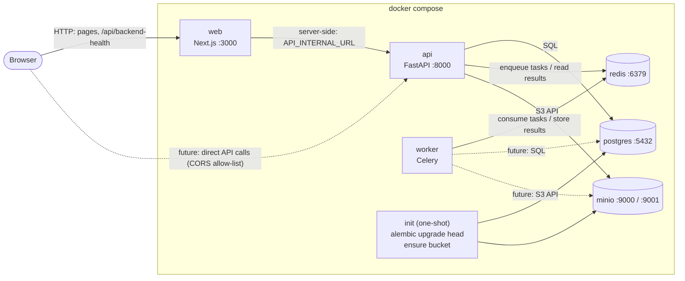

# Architecture

**Stage:** Step 1, engineering foundation. No business functionality exists yet.

## System overview

Invoice Risk & Payment Control OS is a **modular monolith with asynchronous workers**
([ADR 0001](decisions/0001-modular-monolith-with-async-workers.md)). The system has
two applications:

- **Web** (`apps/web`): Next.js 16 / React 19 / TypeScript / Tailwind CSS 4.
- **Backend** (`apps/backend`): one Python 3.12 codebase run as two kinds of process:
  - **API**: FastAPI served by Uvicorn.
  - **Worker**: Celery, for slow or retryable background work.

It depends on three infrastructure services: PostgreSQL 17 (system of record),
Redis 7.4 (Celery broker and result backend, later caching) and S3-compatible object
storage (MinIO locally, for invoice documents later).

## Local architecture



Startup order is expressed with health checks, not sleeps:
`postgres`, `redis`, `minio` (healthy) → `init` (completed successfully) →
`api`, `worker` (healthy) → `web`.

## Component responsibilities

| Component | Responsibility (Step 1) | Health signal |
| --- | --- | --- |
| web | Application shell. Shows API connectivity via a same-origin route handler | `GET /` in the container |
| api | HTTP API, `/health`, `/ready`, versioned router at `/api/v1`, dev-only diagnostics | `GET /health` in the container |
| worker | Executes Celery tasks. Only `system.ping` exists | `celery inspect ping` |
| init | Applies Alembic migrations and creates the storage bucket (local only), then exits | exit code 0 |
| postgres | Relational system of record (no domain tables yet) | `pg_isready` |
| redis | Celery broker and result backend | `redis-cli ping` |
| minio | S3-compatible object storage | `/minio/health/live` |

## Backend layout

```
apps/backend/
├── app/
│   ├── main.py            create_app(): settings, logging, middleware, routers, lifespan
│   ├── cli.py             operational commands (ensure-bucket)
│   ├── core/              config (pydantic-settings), JSON logging, error envelope, middleware
│   ├── api/
│   │   ├── health.py      /health (liveness) and /ready (readiness), unversioned
│   │   └── v1/            /api/v1 router; diagnostics (dev only)
│   ├── db/                declarative Base (naming conventions), engine/session lifecycle
│   ├── infra/             Redis and S3 clients, Resources container, readiness checks
│   ├── worker/            Celery app factory, entrypoint, tasks
│   └── ai/                AIProvider protocol, MockAIProvider, factory
├── migrations/            Alembic environment (no revisions yet)
└── tests/{unit,integration}/
```

### Where future modules go

Each business domain becomes a package under `app/` that owns its models, schemas,
services, routes and tasks:

```
app/<module>/        e.g. auth, organizations, users, vendors, invoices,
  models.py          purchase_orders, risk, approvals, audit, notifications
  schemas.py
  service.py
  router.py          included from app/api/v1/router.py
  tasks.py           added to TASK_MODULES in app/worker/celery_app.py
```

Models import `app.db.base.Base`. Their modules must be imported in
`migrations/env.py` so Alembic autogenerate can see them.

## Communication

| From → To | Mechanism | Notes |
| --- | --- | --- |
| Browser → web | HTTP | Only the web origin is visible to the browser |
| web → api | HTTP, server-side | `API_INTERNAL_URL`, read at runtime ([ADR 0005](decisions/0005-frontend-to-backend-communication.md)) |
| api → worker | Celery message via Redis | `send_task` by name. The API does not need task code. |
| worker → api | Result backend (Redis) | Results expire after 1 hour. Durable state will live in PostgreSQL. |
| api/worker → PostgreSQL | SQLAlchemy 2 (sync) + psycopg 3 | Pooled, `pool_pre_ping`, connect timeout ([ADR 0003](decisions/0003-synchronous-sqlalchemy-with-psycopg.md)) |
| api/worker → object storage | boto3 S3 API | Path-style addressing, short timeouts |

### API conventions

- `/health` and `/ready` are unversioned (they serve orchestrators, not API clients).
- Product endpoints live under `/api/v1`. A breaking change gets `/api/v2` side by side.
- Every error uses one envelope: `{"error": {"code", "message", "request_id", ...}}`.
- Every response carries `X-Request-ID`. A valid incoming ID is propagated; otherwise
  one is generated.

### Health vs readiness

- `GET /health`: liveness. Returns 200 whenever the process can serve HTTP, and never
  touches dependencies, so a database outage does not cause restart loops.
- `GET /ready`: readiness. Checks PostgreSQL (`SELECT 1`), Redis (`PING`) and the
  object-storage bucket (`HeadBucket`) concurrently, with a 5 s timeout each. Returns 200
  or 503 with per-dependency `ok` / `unavailable` only, never error details.
- Clients are created at startup but connect lazily, so the API starts even while a
  dependency is down and recovers without a restart (verified by stopping Redis).
  Celery retries its broker connection on startup.

## Extensibility points

| Need | Extension point |
| --- | --- |
| New domain module | `app/<module>/` + include its router in `app/api/v1/router.py` |
| New background job | Task in `app/<module>/tasks.py`, registered via `TASK_MODULES` |
| Schema change | `uv run alembic revision --autogenerate -m "..."` |
| New dependency check | Add a `ReadinessCheck` in `Resources.readiness_checks()` |
| New AI provider | Implement `AIProvider`, then branch in `app/ai/factory.py` ([ADR 0007](decisions/0007-ai-provider-abstraction.md)) |
| Storage backend | Any S3-compatible service via `S3_*` settings |
| Shared TS/Python contracts | Generate TypeScript types from `/openapi.json` when needed |
| Scheduled jobs | Celery beat as another process of the backend image |

## Major decisions

See [`docs/decisions/`](decisions/README.md).
