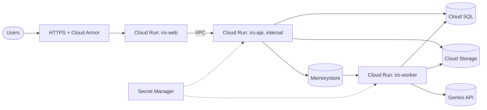

# Deployment on Google Cloud

This guide describes how to host V1 on Google Cloud. **No Google Cloud resources were
provisioned while building V1** (per the build instructions), so every command below is
**NOT VERIFIED** against a real project. The application code, images and configuration
*are* designed and tested for this target: the `PORT` variable, graceful shutdown, JSON
logs with `severity` and trace correlation, the GCS storage backend, Secret Manager-friendly
configuration, a separate migration step, and a worker health port.

## Target architecture

| Component | Google Cloud service | Notes |
| --- | --- | --- |
| Web (Next.js) | **Cloud Run** service `irs-web` | Public, behind HTTPS (custom domain or load balancer + Cloud Armor) |
| API (FastAPI) | **Cloud Run** service `irs-api` | Ingress `internal`; reached by `irs-web` over the VPC |
| Worker (Celery) | **Cloud Run** service `irs-worker` (always-on CPU, min 1) | Uses `WORKER_HEALTH_PORT` for the platform probe. Alternatives: Cloud Run worker pools, a GCE MIG. |
| Migrations | **Cloud Run job** `irs-migrate` | `alembic upgrade head` before each release |
| PostgreSQL | **Cloud SQL** for PostgreSQL 17 (private IP) | Automated backups + point-in-time recovery |
| Redis | **Memorystore** for Redis | AUTH enabled; in-transit encryption optional (see below) |
| Documents | **Cloud Storage** bucket | Uniform access, public access prevention, `OBJECT_STORAGE_BACKEND=gcs` |
| Images | **Artifact Registry** | `irs/backend`, `irs/web` |
| Secrets | **Secret Manager** | `AUTH_SECRET`, `DATA_ENCRYPTION_KEY`, `GEMINI_API_KEY`, `DATABASE_URL`, `REDIS_URL` |
| Logs / metrics / traces | **Cloud Logging / Monitoring / Trace** | JSON logs are parsed natively; set `GOOGLE_CLOUD_PROJECT` for trace correlation |

Region: **`asia-south1` (Mumbai)** for India data residency (`asia-south2`, Delhi, as DR).



## 0. Variables

```bash
export PROJECT=your-project-id REGION=asia-south1
export AR=$REGION-docker.pkg.dev/$PROJECT/irs
export SQL_INSTANCE=irs-postgres BUCKET=$PROJECT-irs-documents
gcloud config set project $PROJECT
```

## 1. Enable APIs and create the network

```bash
gcloud services enable run.googleapis.com sqladmin.googleapis.com redis.googleapis.com \
  storage.googleapis.com artifactregistry.googleapis.com secretmanager.googleapis.com \
  compute.googleapis.com servicenetworking.googleapis.com cloudbuild.googleapis.com \
  logging.googleapis.com monitoring.googleapis.com cloudtrace.googleapis.com

gcloud compute networks create irs-vpc --subnet-mode=custom
gcloud compute networks subnets create irs-run --network=irs-vpc --region=$REGION --range=10.10.0.0/24
# Private services access, for Cloud SQL private IP and Memorystore
gcloud compute addresses create irs-psa --global --purpose=VPC_PEERING --prefix-length=20 --network=irs-vpc
gcloud services vpc-peerings connect --service=servicenetworking.googleapis.com --ranges=irs-psa --network=irs-vpc
```

## 2. Service accounts (least privilege)

```bash
for sa in irs-web irs-api irs-worker irs-migrate; do gcloud iam service-accounts create $sa; done
# API, worker and migration job: Cloud SQL client
for sa in irs-api irs-worker irs-migrate; do
  gcloud projects add-iam-policy-binding $PROJECT --role=roles/cloudsql.client \
    --member=serviceAccount:$sa@$PROJECT.iam.gserviceaccount.com
done
```

The web service needs no data permissions. It only calls the API.

## 3. Data stores

```bash
# Cloud SQL (private IP, backups, PITR)
gcloud sql instances create $SQL_INSTANCE --database-version=POSTGRES_17 --region=$REGION \
  --tier=db-custom-2-7680 --network=irs-vpc --no-assign-ip \
  --backup-start-time=20:30 --enable-point-in-time-recovery --availability-type=REGIONAL
gcloud sql databases create invoice_risk --instance=$SQL_INSTANCE
gcloud sql users create invoice_risk --instance=$SQL_INSTANCE --password="$(openssl rand -base64 24)"
# (record the password; it goes into the DATABASE_URL secret)

# Memorystore Redis with AUTH
gcloud redis instances create irs-redis --region=$REGION --tier=standard --size=1 \
  --network=irs-vpc --connect-mode=PRIVATE_SERVICE_ACCESS --enable-auth --redis-version=redis_7_2
gcloud redis instances get-auth-string irs-redis --region=$REGION

# Cloud Storage: private, uniform access, versioned
gcloud storage buckets create gs://$BUCKET --location=$REGION --uniform-bucket-level-access \
  --public-access-prevention
gcloud storage buckets update gs://$BUCKET --versioning
for sa in irs-api irs-worker; do
  gcloud storage buckets add-iam-policy-binding gs://$BUCKET --role=roles/storage.objectAdmin \
    --member=serviceAccount:$sa@$PROJECT.iam.gserviceaccount.com
done
```

## 4. Secrets

```bash
printf '%s' "$(openssl rand -hex 32)"    | gcloud secrets create irs-auth-secret --data-file=-
printf '%s' "$(openssl rand -base64 32)" | gcloud secrets create irs-data-encryption-key --data-file=-
printf '%s' "$GEMINI_API_KEY"            | gcloud secrets create irs-gemini-api-key --data-file=-
# Cloud SQL via the built-in Unix-socket connector:
printf '%s' "postgresql+psycopg://invoice_risk:DB_PASSWORD@/invoice_risk?host=/cloudsql/$PROJECT:$REGION:$SQL_INSTANCE" \
  | gcloud secrets create irs-database-url --data-file=-
printf '%s' "redis://:REDIS_AUTH_STRING@REDIS_PRIVATE_IP:6379/0" | gcloud secrets create irs-redis-url --data-file=-
for sa in irs-api irs-worker irs-migrate; do for s in irs-auth-secret irs-data-encryption-key irs-gemini-api-key irs-database-url irs-redis-url; do
  gcloud secrets add-iam-policy-binding $s --role=roles/secretmanager.secretAccessor \
    --member=serviceAccount:$sa@$PROJECT.iam.gserviceaccount.com; done; done
```

**Back up `DATA_ENCRYPTION_KEY` separately.** Losing it makes stored bank account numbers
unreadable. Rotating it requires a re-encryption script, which is not included in V1.

For Memorystore **in-transit encryption**, use a `rediss://` URL and mount the instance's
server CA certificate. That path is not implemented or tested in V1, so the commands
above use AUTH over the private network.

## 5. Build and push images

```bash
gcloud artifacts repositories create irs --repository-format=docker --location=$REGION
gcloud auth configure-docker $REGION-docker.pkg.dev
TAG=$(git rev-parse --short HEAD)
docker buildx build --platform linux/amd64 -t $AR/backend:$TAG apps/backend --push
docker buildx build --platform linux/amd64 -t $AR/web:$TAG apps/web --push
```

## 6. Deploy

Common backend settings, passed on every backend deploy command below:

```bash
BACKEND_ENV="APP_ENV=production,LOG_LEVEL=INFO,GOOGLE_CLOUD_PROJECT=$PROJECT,\
OBJECT_STORAGE_BACKEND=gcs,OBJECT_STORAGE_BUCKET=$BUCKET,AI_PROVIDER=gemini,\
GEMINI_MODEL=gemini-3.8-flash,SESSION_COOKIE_SECURE=true,URL_IMPORT_ALLOW_HTTP=false,\
ENABLE_DIAGNOSTICS_ENDPOINTS=false,APP_BASE_URL=https://app.example.in,\
CORS_ALLOWED_ORIGINS=https://app.example.in,INBOUND_EMAIL_DOMAIN=inbound.example.in,\
TRUSTED_PROXY_HOPS=2"
BACKEND_SECRETS="AUTH_SECRET=irs-auth-secret:latest,DATA_ENCRYPTION_KEY=irs-data-encryption-key:latest,\
GEMINI_API_KEY=irs-gemini-api-key:latest,DATABASE_URL=irs-database-url:latest,REDIS_URL=irs-redis-url:latest"
COMMON="--region=$REGION --image=$AR/backend:$TAG --set-env-vars=$BACKEND_ENV --set-secrets=$BACKEND_SECRETS \
  --add-cloudsql-instances=$PROJECT:$REGION:$SQL_INSTANCE --network=irs-vpc --subnet=irs-run --vpc-egress=private-ranges-only"
```

```bash
# 6a. Migrations (run before every release)
gcloud run jobs deploy irs-migrate $COMMON --service-account=irs-migrate@$PROJECT.iam.gserviceaccount.com \
  --command=alembic --args=upgrade,head
gcloud run jobs execute irs-migrate --region=$REGION --wait

# 6b. API: internal only
gcloud run deploy irs-api $COMMON --service-account=irs-api@$PROJECT.iam.gserviceaccount.com \
  --ingress=internal --no-allow-unauthenticated --port=8080 --cpu=1 --memory=1Gi \
  --min-instances=1 --max-instances=10 --concurrency=40 --timeout=120

# 6c. Worker: always-on CPU, health port for the platform probe
gcloud run deploy irs-worker $COMMON --service-account=irs-worker@$PROJECT.iam.gserviceaccount.com \
  --ingress=internal --no-allow-unauthenticated --no-cpu-throttling --min-instances=1 --max-instances=4 \
  --cpu=2 --memory=2Gi --port=8080 --update-env-vars=WORKER_HEALTH_PORT=8080 \
  --command=celery --args=-A,app.worker.main,worker,--loglevel=INFO,--concurrency=4

# 6d. Web: public, calls the API over the VPC
API_URL=$(gcloud run services describe irs-api --region=$REGION --format='value(status.url)')
# Only the web service may invoke the private API (Cloud Run IAM):
gcloud run services add-iam-policy-binding irs-api --region=$REGION --role=roles/run.invoker \
  --member=serviceAccount:irs-web@$PROJECT.iam.gserviceaccount.com
gcloud run deploy irs-web --region=$REGION --image=$AR/web:$TAG --allow-unauthenticated \
  --service-account=irs-web@$PROJECT.iam.gserviceaccount.com \
  --set-env-vars=API_INTERNAL_URL=$API_URL,API_ID_TOKEN_AUDIENCE=$API_URL \
  --network=irs-vpc --subnet=irs-run --vpc-egress=all-traffic --port=3000 --min-instances=1
```

`API_ID_TOKEN_AUDIENCE` makes the web proxy fetch a Google identity token for the API from
the metadata server and send it as `Authorization: Bearer …` (`apps/web/src/lib/api-auth.ts`,
unit-tested). Cloud Run IAM validates it, and users are still authenticated by session
cookie inside the API. The API is therefore both network-internal and IAM-protected.

Points to check during the first deployment (all **NOT VERIFIED**):

- **`TRUSTED_PROXY_HOPS`:** send a request and check the audit log's `ip_address` for the
  real client address. The value depends on the load balancer and VPC path (Compose uses 1).
- **Inbound email:** expose `POST /api/v1/email-ingestion/inbound` through the web
  domain (the proxy forwards `X-Ingestion-Token`) and point your mail provider's
  inbound-parse webhook at it.

## 7. Domain, TLS and edge protection

Map a custom domain to `irs-web` (or put an external HTTPS load balancer with a serverless
NEG in front of it) and attach **Cloud Armor**: OWASP rules and a per-IP rate limit on
`/api/v1/auth/*`. HSTS belongs at the load balancer or in `next.config.ts` once HTTPS is final.

## 8. Observability

- **Logs:** backend logs are JSON with `severity`, `request_id`, `organization_id`,
  `user_id` and `logging.googleapis.com/trace`. Cloud Logging parses them automatically.
- **Suggested log-based metrics and alerts:**
  - `jsonPayload.message="invoice processing failed"`
  - HTTP 5xx rate
  - `jsonPayload.message="ai risk explanation unavailable"` (AI degradation)
  - `jsonPayload.message="unhandled exception"`
- **Uptime checks:** `GET /health` on `irs-web` via `/api/backend-health`. For internal
  readiness, alert on `/ready` failures logged by the API.
- **Tracing:** V1 correlates logs to Cloud Trace IDs. OpenTelemetry spans are not yet
  instrumented (future work).

## 9. Production checklist

- [ ] `APP_ENV=production` (the app refuses unsafe settings at startup)
- [ ] Secrets only from Secret Manager; `DATA_ENCRYPTION_KEY` backed up offline
- [ ] Cloud SQL backups and PITR enabled; a restore test performed
- [ ] Bucket public access prevention enabled; object versioning on
- [ ] `irs-api` and `irs-worker` not publicly reachable
- [ ] Cloud Armor in front of `irs-web`
- [ ] Gemini data-use terms confirmed for the customer (or AI disabled per organization)
- [ ] Alerts on processing failures and 5xx
- [ ] A first owner account created via signup; signup restricted or monitored afterwards

## Rollback

Cloud Run keeps revisions: `gcloud run services update-traffic irs-api --to-revisions=PREVIOUS=100`
(the same for web and worker). Migrations are forward-only in production. Write each new
migration to be backward-compatible with the previous release (expand, then contract).
